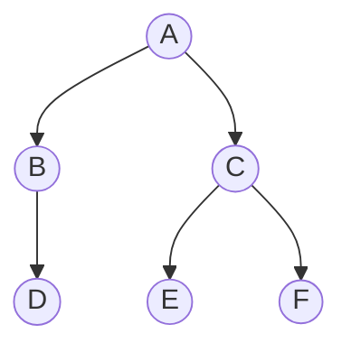
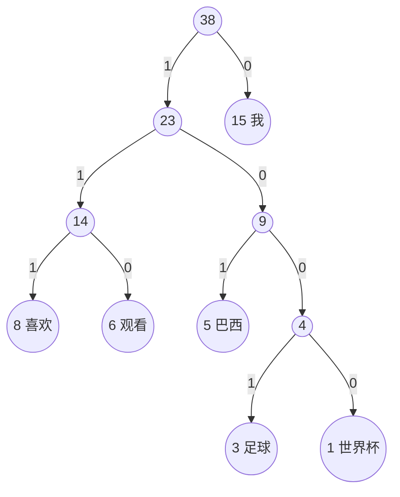
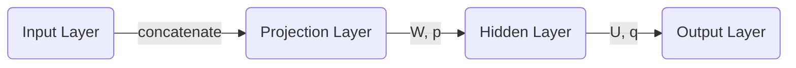

<h1>Word2vec中的数学原理<h1>

## 1 预备知识
### 1.1 sigmoid函数
sigmoid函数是神经网络中常用的激活函数之一，其定义为：

$$
\begin{equation}
\sigma(x) = \frac {1}{1 + e^{-x}}
\label{eq:1.1}
\end{equation}
$$

该函数将定义在$(-\infty,+\infty)$上的自变量$x$映射到$(0,1)$内，通常用来表示二分类概率。

sigmoid函数的导函数具有以下形式：
$$
\begin{equation}
\sigma^\prime(x) = \sigma(x)(1-\sigma(x))
\label{eq:1.2}
\end{equation}
$$

由公式$\eqref{eq:1.2}$可知，函数$log\sigma(x)$和$log(1-\sigma(x))$的导函数分别为：
$$
\begin{equation}
[\log\sigma(x)]^\prime = 1-\sigma(x),\quad [\log(1-\sigma(x))]^\prime = -\sigma(x)
\label{eq:1.3}
\end{equation}
$$
公式$\eqref{eq:1.3}$在后面的推导中会经常用到。

### 1.2 逻辑回归

设${(\vec{x^{(i)}},y_i)}^{m}_{i=1}$为一个**二分类**问题得样本数据，其中$\vec{x^{(i)}} \in R^n, \; y_i \in \lbrace0,1\rbrace$， 当$y_i=1$时称样本为正例，当$y_i=0$时称样本为负例。  
利用sigmoid函数，对于任意样本$\vec{x}=(x_1,x_2,...,x_n)^T$，可将二分类问题的目标函数写成：
$$
\begin{equation}
h_{\theta}(\vec{x}) = \sigma(\theta_{0}+\theta_{1}x_{1}+\theta_{2}x_{2}+...+\theta_{n}x_{n})
\label{eq:1.4}
\end{equation}
$$
其中$\theta=(\theta_{0},\theta_{1},...,\theta_{n})^{T}$为待定参数，为了防止符号上简化起见，引入$x_{0}=1$将$\vec{x}$扩展为$(x_0,x_1,x_2,...,x_n)^T$

，且在不引起混淆的情况下仍将其记为$\vec{x}$。于是，$h_{\theta}$可简写为：
$$
\begin{equation}
h_{\theta}(\vec{x}) = \sigma(\theta^{T}\vec{x}) = \frac {1}{1+e^{-\theta^{T}\vec{x}}}
\label{eq:1.5}
\end{equation}
$$
从这个角度理解，这个函数就是一个简单的决策函数，一个根据$\vec{x}$计算该样本属于正例的概率的函数，我们根据概率值的大小进行分类。

若取分类阈值$T=0.5$，则二分类的判别公式为：
$$
\begin{equation}
y(h_\theta)=
\begin{cases}
1, \quad  \text{$h_\theta\geq0.5$} \\
0, \quad \text{$h_\theta<0.5$}
\end{cases}
\label{eq:1.6}
\end{equation}
$$

单个样本$(\vec{x^{(i)}},y^{(i)})$的似然函数（单个样本预测正确的概率）：
$$
\begin{equation}
L(\theta)^{(i)} = h_\theta(\vec{x^{(i)}})^{y^{(i)}}(1-h_\theta(\vec{x^{(i)}}))^{1-y^{(i)}}, \quad y^{(i)}=0,1
\label{eq:1.7}
\end{equation}
$$
式$\eqref{eq:1.7}$中$\vec{x^{(i)}}$表示第$i$个样本，$y^{(i)}$表示第$i$个样本的标签。

优化目标：==选择合适的$\theta$使得预测出的结果全部正确的概率最大，即所有样本预测正确的概率的乘积最大==，总体似然估计表达式如下：
$$
\begin{equation}
L(\theta) = \prod_{i=1}^{m}h_\theta(\vec{x^{(i)}})^{y^{(i)}}(1-h_\theta(\vec{x^{(i)}}))^{1-y^{(i)}}, \quad \text{$m$为样本数}
\label{eq:1.8}
\end{equation}
$$
取对数，并将其相反数作为逻辑回归的损失函数：
$$
\begin{equation}
J(\theta) = -\frac{1}{m}\sum_{i=1}^m[y^{(i)}\log(h_\theta(\vec{x^{(i)}}))+(1-y^{(i)})\log(1-h_\theta(\vec{x^{(i)}}))]
\label{eq:1.9}
\end{equation}
$$
优化目标：==最小化$J(\theta)$==获取最优$\theta$即可。

对于任意一个参数$\theta_j$，可采用梯度下降方法求解，先设置一个学习率$\alpha$，根据$\frac{\partial{J(\theta)}}{\theta_j}$逐步更新：
$$
\begin{equation}
\theta_j = \theta_j - \alpha\cdot\frac{\partial{J(\theta)}}{\theta_j}
\label{eq:1.10}
\end{equation}
$$
式$\eqref{eq:1.10}$中$\frac{\partial{J(\theta)}}{\theta_j}$推导如下：
$$
\begin{equation}\begin{split} 
\frac{\partial{J(\theta)}}{\theta_j} &= -\frac{1}{m}\sum_{i=1}^{m}[y^{(i)}(1-h_\theta(\vec{x^{(i)}}))+(1-y^{(i)})(-h_\theta(\vec{x^{(i)}}))]\cdot{x^{(i)}_j}\\
&= -\frac{1}{m}\sum_{i=1}^{m}[y^{(i)}-y^{(i)}h_\theta(\vec{x^{(i)}})-h_\theta(\vec{x^{(i)}})+y^{(i)}h_\theta(\vec{x^{(i)}})]\cdot{x^{(i)}_j}\\
&= -\frac{1}{m}\sum_{i=1}^{m}[y^{(i)}-h_\theta(\vec{x^{(i)}})]\cdot{x^{(i)}_j}
\end{split}\label{eq:1.11}\end{equation}
$$
式$\eqref{eq:1.11}$中${x^{(i)}_j}$表示第$i$个样本中第$j$个特征的值。

### 1.3 Bayes公式

贝叶斯公式是英国数学家贝叶斯提出来的，用来描述两个条件概率之间的关系。若记$P(A),P(B)$分别表示事件$A$和事件$B$发生的概率，$P(A|B)$表示事件$B$发生的情况下事件$A$发生的概率，$P(A,B)$表示事件$A,B$同时$A$发生的概率，则有
$$
\begin{equation}
P(A|B) = \frac{P(A,B)}{P(B)},\quad P(B|A) = \frac{P(A,B)}{P(A)}
\label{eq:1.12}
\end{equation}
$$
利用式$\eqref{eq:1.12}$，进一步可得**Bayes公式**：
$$
\begin{equation}
P(A|B) = \frac{P(B|A)\cdot{P(A)}}{P(B)}
\label{eq:1.13}
\end{equation}
$$

### 1.4 Huffman编码

#### 1.4.1 Huffman树

在计算机科学中，树是一种重要的非线性数据结构，她是数据元素（在树中称为节点）按分支关系组织起来的结构。若干课互不相交的树所构成的集合称为森林。下面给出几个与树相关的常用概念。

**二叉树**是每个结点最多有两个子树的**有序**树，两个子树通常被称为“**左子树**”和“**右子树**”，定义中的“有序”是指两个子树有左右之分，顺序不能颠倒。

- **树的路径长度**

  树的路径长度是指“**从树根到每一个节点的路径长度的总和**”，相同节点个数下，完全二叉树就是这种路径长度最短的二叉树，注意这是对于二叉树而言。

  该树的路径长度为：(AB)+(AB)+(BD)+(AC)+(AC)+(CE)+(AC)+(CF)

- **结点的权和带权路径长度**

  若为树中结点赋予一个具有某种含义的（非负）数值，则这个数值称为该结点的权。**结点的带权路径长度是指该结点的深度与权的乘积，而非由根节点到该结点的路径上所有权值相加。**

- **树的带权路径长度**

  所有**叶子节点**的带权路径长度之和。

给定$n$个权值作为$n$个叶子节点，构造一棵二叉树，若他的带权路径长度达到最小，则称这样的二叉树为**最优二叉树**，也称为**Huffman树**。

#### 1.4.2 Huffman树的构造

给定$n$个权值$\lbrace\omega_1,\omega_2,...,\omega_n\rbrace$作为二叉树的$n$个叶子结点，可以通过以下算法来构造一颗Huffman树。

**Huffman树构造算法**

（1） 将$\lbrace\omega_1,\omega_2,...,\omega_n\rbrace$看成是有$n$颗树的森林（每棵树仅有一个结点）.

（2）在森林中选出两个根节点的权值最小的数合并，作为一棵新树的左、右子树（默认约定将权值大的结点作为左子树，反之亦可），且新树根节点权值为其左、右子树根节点权值之和。

（3）从森林中删除选取的两棵树，并将新树加入森林。

（4）重复（2）、（3）步，直到森林中只剩一棵树为止，该树即为所求的Hffman树。

#### 1.4.3 Huffman编码

数据通信中，需要将传送的文字转换成二进制的字符串，用0，1码的不同排列来表示字符。例如，需传送的额报文为“AFTER DATA EAR ARE ART AREA"，这里用到的字符集为”A，E，R，T，F，D"，各字母出现的次数为8，4，5，3，1，1.现要求为这些字母设计编码。

要区别6个字母，最简单的二进制编码方式是等长编码，固定采用$\;3\;$位二进制$\;(2^3=8>6)$，可分别用000、001、010、011、100、101对”A，E，R，T，F，D"进行编码发送，当对方接收报文时再按照三位一分进行译码。

显然编码长度取决于报文中不同字符的个数，若报文中可能出现26个不同字符，则固定编码长度为$\;5(2^5=32>26)$。然而，传送报文时总是希望总长度尽可能短，在实际应用中，各个字符的出现频度或使用次数是不相同的，如A、B、C的使用频率远远高于X、Y、Z，自然会想到设计编码时，让使用频率高的用短码，使用频率低的用长码，以优化整个报文编码。

为使不等长编码为**前缀编码（即要求一个字符的编码不能是另一个字符编码的前缀）**，可用字符集中的每个字符作为叶子节点生成一颗编码二叉树，为了获得传送报文的最短长度，可将每个字的出现频率作为字符结点的权值赋予该节点上，显然字使用频率越小权值越小，权值越小叶子就越靠下，于是**频率小编码长，频率高编码短**，这样就保证了次数的最小带权路径长度，效果上就是传送报文的最短长度。因此，求传送报文的最短长度问题转化为求由字符集中所有字符作为叶子节点，由字符出现频率作为其权值所产生的Huffman树的问题。利用Huffman树设计的二进制前缀编码，称为**Huffman编码**，它既能满足前缀编码的条件，又能保证报文编码总长度最短。

本文将介绍的word2vec工具中也将用到Huffman编码，它把训练语料中的词当成叶子节点，其在语料中出现的次数当作权值，通过构造相应的Huffman树来对每一个词进行Huffman编码。

下图中给出了“我”、“喜欢”、“观看”、“巴西”、“足球”、“世界杯”这6个词（词频为：15，8，6，5，3，1）的Huffman编码，约定（词频较大的）左孩子结点编码为1，（词频较小的）右孩子编码为0，这六个词的Huffman编码分别为0，111，110，101，1001，1000.

综上所述，关于Huffman树和Huffman编码，有两个约定：

- 将权值大的结点作为左孩子结点，权值小的作为右孩子结点

- 左孩子结点编码为1，右孩子结点编码为0

word2vec源码中将权值较大的孩子结点编码为1，较小的孩子结点编码为0.统一起见，下文中提到的“左孩子结点”都是权值较大的孩子结点。

## 2 背景知识

word2vec是用来生成词向量的工具，而词向量与语言模型有密切的关系，为此 ，不妨先来了解一些语言模型方面的知识。

### 2.1统计语言模型

统计语言模型是用来计算一个句子概率的概率模型，它通常基于一个语料库来构建。那什么叫做一个句子的概率呢？假设$\;W\;=\;w_1^T\;=\;(w_1,w_2,...,w_T)\;$表示由$\;T\;$个词$\;w_1,w_2,...,w_T\;$按顺序构成的一个句子，则$\;w_1,w_2,...,w_T\;$的联合概率
$$
\begin{equation}
p(W)\;=\;p(w_1^T)\;=p(w_1,w_2,...,w_T)
\label{eq:2.1}
\end{equation}
$$
就是这个句子的概率。利用**Bayes公式**，上式可以被链式分解为
$$
\begin{equation}
p(w_1^T) = p(w_1)\cdot{p(w_2|w_1)}\cdot{p(w_3|w_1^2)}\cdot\cdot\cdot{p(w_T|w_1^{T-1})}
\label{eq:2.2}
\end{equation}
$$
其中的条件概率$\;p(w_1),{p(w_2|w_1)},{p(w_3|w_1^2)},...,{p(w_T|w_1^{T-1})}\;$就是语言模型的参数，若这些参数已经全部算得，那么给定一个句子$w_1^T$，就可以很快算出相应的$\;p(w_1^T)\;$了。

对于给定长度为$\;T\;$的句子，就需要计算$\;T\;$个参数，不妨假设语料库对应词典$\;D\;$的大小（即词汇量）为$\;N\;$，那么，如果考虑长度为$\;T\;$的任意句子，理论上就有$\;N^T\;$种可能，而每种可能都要计算$\;T\;$个参数，总共就需要计算$\;TN^T\;$个参数。当然这只是简单估算，并没有考虑重复参数，但这个量级已经无比巨大了。此外，这些概率计算好之后还得保存下来，因此，存储这些信息也需要很大的内存开销。

此外，这些参数如何计算呢？常见的方法有**n-gram**模型、决策树、最大熵模型、最大熵马尔可夫模型、条件随机场、**神经网络**等方法。

### 2.2 n-gram模型

由式$\eqref{eq:2.2}$可知：
$$
\begin{equation}
p(w_k|w_1^{k-1}) = \frac{p(w_1^k)}{p(w_1^{k-1})}
\label{eq:2.3}
\end{equation}
$$
根据大数定理，当语料足够大时（可用频数表示概率），$p(w_k|w_1^{k-1})$可近似表示为
$$
\begin{equation}
p(w_k|w_1^{k-1})\approx{\frac{count(w_1^k)}{count(w_1^{k-1})}}
\label{eq:2.4}
\end{equation}
$$
其中$\;count(w_1^k)\;$和$\;count(w_1^{k-1})\;$分别表示词串$\;w_1^k\;$和$\;w_1^{k-1}\;$在语料种出现的次数。可想而知，当$\;k\;$很大时，$\;count(w_1^k)\;$和$\;count(w_1^{k-1})\;$统计将会多么耗时。

从公式$\eqref{eq:2.4}$可以看出：一个词出现的概率和他前面所有词都相关，如果假定一个词出现的概率只和它前面固定数目的词相关呢？这就是**n-gram模型**的基本思想，它作了一个$\;n-1\;$阶马尔可夫假设，认为一个词出现的概率就只与他前面的 $\;n-1\;$个词相关，即
$$
\begin{equation}
p(w_k|w_1^{k-1})\approx{p(w_k|w_{k-n+1}^{k-1})}
\label{eq:2.5}
\end{equation}
$$
于是，式$\eqref{eq:2.5}$就变成了
$$
\begin{equation}
p(w_k|w_1^{k-1})\approx{\frac{count(w_{k-n+1}^{k})}{count_{k-n+1}^{k-1}}}
\label{eq:2.6}
\end{equation}
$$
以$\;n=2\;$为例，就有
$$
\begin{equation}
p(w_k|w_1^{k-1})\approx{\frac{count(w_{k-1},w_{k})}{count(w_{k-1})}}
\label{eq:2.7}
\end{equation}
$$
这样一简化，不仅使得单个参数的统计变得更容易，也使得参数总数变少了。

那么，n-gram中的参数n取多大比较合适呢？一般来说，n的选取需要同时考虑计算复杂度和模型效果两个因素。

表 1 模型参数数量与n的关系

| n            | 模型参数数量      |
| ------------ | ----------------- |
| 1（unigram)  | $2\times10^5$     |
| 2（bigram)   | $4\times10^{10}$  |
| 3（trigram） | $8\times10^{15}$  |
| 4（4-gram)   | $16\times10^{20}$ |

在**计算复杂度**方面，表1给出了n-gram模型中模型参数数量随着n的逐渐增大而变化的情况，其中假定词典大小$\;N=200000$（==汉语的词汇量大致是这个量级==）。事实上，模型参数的量级是$N$的指数函数$(O(N^n))$，显然$n$不能取得太大，实际应用中最多的是采用$\;n=3\;$的三元模型。

在**模型效果**方面，理论上是$\;n\;$越大，效果越好。现如今，互联网的海量数据以及机器性能的提升使得计算更高阶的语言模型（如$\;n>10\;$）成为可能，但需要注意的是，当$\;n\;$大到一定的程度时，模型的效果的提升幅度会变小。例如，当$\;n\;$从$\;1\;$到$\;2\;$，再从$\;2\;$到$\;3\;$时，模型的效果上升显著，而从$\;3\;$到$\;4\;$时，效果的提升就不明显了。事实上，这里还涉及到一个**可靠性**和**可区别性**的问题，参数越多，可区别性越好，但同时单个参数的实例变少从而降低了可区别性，因此需要在可靠性和可区别性之间进行折中考虑。

总结起来，n-gram模型是这样的一种模型，其主要工作是再语料中统计各种词出现的次数以及平滑化处理。概率值计算之后就存储起来，下次需要计算一个句子的概率时，只需要找到相关的概率参数，将他们连乘起来即可。

然而，在机器学习领域有一种通用的招数是这样的：对所考虑的问题建模后先为其构造一个目标函数，然后对这个目标函数进行优化，从而求得一组最优参数，最后利用这组最优参数对应的模型来进行预测。

对于统计语言模型，利用**最大似然**，可把目标函数设为
$$
\begin{equation}
\prod_{w\in{C}}p(w|Content(w))
\label{eq2.8}
\end{equation}
$$
其中$\;C\;$表示语料（Corpus），$Content(w)$表示词$\;w\;$的上下文（Context），即$\;w\;$周边的词的集合。当$\;Context(w)\;$为空时，就取$\;p(w|Context(w))=p(w)\;$。特别地，对于前面介绍的n-gram模型，就有$\;Context(w_i)=w_{i-n+k}^{i-1}\;$.

注：  
	语料$\;C\;$和词典$\;D\;$的区别：词典$\;D\;$是从语料$\;C\;$中抽取出来的，不存在重复的词；而语料$\;C\;$是指所有的文本内容，包括重复的词。

当然，实际应用中常采用**最大对数似然**，即把目标设为
$$
\begin{equation}
L = \sum_{w\in{C}}\log{p(w|Context(w))}
\label{eq:2.9}
\end{equation}
$$
然后对这个函数进行最大化。

从式$\eqref{eq:2.9}$可见，概率$\;p(w|Context(w))\;$已被视为关于$\;w\;$和$\;Context(w)\;$的函数，即
$$
\begin{equation}
p(w|Context(w))=F(w,Context(w),\theta)
\label{eq:2.10}
\end{equation}
$$
其中$\;\theta\;$为待定参数集。这样一来，一旦对$\eqref{eq:2.9}$进行优化得到最优参数$\;\theta^*\;$后，$\;F\;$也就唯一被确定了，以后任何概率$\;p(w|Context(w))\;$就可以通过函数$\;F(w,Context(w))\;$来计算了。与n-gram相比，这种方法不需要（事先计算并）保存所有的概率值，而是通过直接计算来获取，且通过选取合适的模型可使得$\;\theta\;$中参数个数远小于n-gram中模型的个数。

很显然，对于这样一种方法，最关键的地方在于**函数$\;F\;$的构造**。下一小节将介绍一种通过神经网络来构造$\;F\;$的方法，它是word2vec的前身和基础。

### 2.3 神经概率语言模型

本小节将介绍Bengio等人在2003年提出的一种神经网络语言模型。该模型中用到了一个重要工具——**词向量**。

什么是词向量？简单来说就是，对词典$\;D\;$中任意词$\;w\;$，指定一个固定长度的实值向量$\;\vec{v}(w)\in{R^m}$，$\;\vec{v}(w)\;$就称为$\;w\;$的词向量，$\;m\;$为词向量的长度，关于词向量的进一步理解将放到下一小节来讲解。

既然是神经概率语言模型，其中当然要用到一个神经网路。下图给出了这个神经网络的结构示意图，它包括四个层：输入（Input）层、投影（Projection）层、隐藏（Hidden）层和输出（Output）层。其中$\;W,U\;$分别为投影层与隐藏层以及隐藏层与输出层之间的权值矩阵，$\;\vec{p},\vec{q}\;$分别为隐藏层和输出层上的偏置向量。

对于语料$\;C\;$中任意一个词$\;w\;$,将$\;Context(w)\;$取为其前面的$\;n-1\;$个词（类似于n-gram），这样二元组$\;(Context(w),w)\;$就是一个训练脚本了。接下来，讨论样本$\;(Context(w),w)\;$经过神经网络时是如何参与计算的。注意，一旦语料$\;C\;$和词向量长度$\;m\;$给定后，投影层和输出层的规模就确定了，前者为$\;(n-1)m\;$,后者为$\;N=|D|\;$即语料$\;C\;$的词汇量大小。而隐藏层的规模$\;n_h\;$是可调参数由用户指定。

为什么投影层的规模是$\;(n-1)m\;$呢？因为输入层包含$\;Context(w)\;$中$\;n-1\;$个词的词向量，而投影层的向量$\;\vec{x}_w\;$是这样构造的：将输入层的$\;n-1\;$个词向量按顺序首尾相接地拼接起来行成一个长向量，其长度当然就是$\;(n-1)m\;$了。有了向量$\;\vec{x}_w$，接下来地计算过程就很平凡了，具体为
$$
\begin{equation}
\begin{cases}
\vec{z}_w=\tanh(W\vec{x}_w+\vec{p}) \\
\vec{y}_w=U\vec{z}_w+\vec{q}
\end{cases}
\label{eq:2.11}
\end{equation}
$$
其中tanh为双曲正切函数，用来做隐藏层地激活函数，上式中，tanh作用在向量上表示他作用在向量地每一个分量上。

注：  
对于语料中地一个给定句子地前几个词，其前面地词不足$\;n-1\;$怎么办？ 此时可以认为地添加一个或几个填充向量就可以了，它们也参与训练过程。

经过上述两步计算得到地$\;\vec{y}_w=(y_{w,1},y_{w,2},...,w_{w,N})^T\;$只是一个长度为$\;N\;$的向量，其分量不能用概率表示。如果想要$\;\vec{y}_w$的分量$\;y_{w,i}$表示上下文为$\;Context(w)\;$时的下一个词恰为词典$\;D\;$中第$\;i\;$个词的概率，则还需要做一个**softmax归一化**，归一化后，$\;p(w|Context(w))\;$就可以表示为
$$
\begin{equation}
p(w|Context(w))=\frac{e^{y_{w,i_w}}}{\sum_{i=1}^{N}e^{y_{w,i}}}
\label{eq:2.12}
\end{equation}
$$
其中$\;i_w\;$表示词$\;w\;$在词典$\;D\;$中的索引。

公式$\eqref{eq:2.12}$给出了概率$\;p(w|Context(w))\;$的函数表示，即摘到了上一小节中提到的函数$\;F(w,Context(w),\theta)\;$，那么其中待确定的参数$\;\theta\;$有哪些呢？总结起来，包括两部分

- 词向量：$\vec{v}(w)\in{R^m},w\in{D}\;$以及填充向量
- 神经网络参数：$W\in{R^{n_h\times{(n-1)m}}},\vec{p}\in{R^{n_h}};U\in{R^{N\times{n_h}}},\vec{q}\in{R^N}$

这些参数均通过训练算法得到。值得一提的是，通常机器学习算法中，输入都是已知的，而在上述神经概率语言模型中，输入$\;\vec{v}(w)\;$也需要通过训练才能得到。

接下来，简要地分析一下上述模型的运算量。在神经网络中，投影层、隐藏层和输出层的规模分别为$\;(n-1)m,n_h,N\;$，依次看看其中涉及的参数：

（1）$\;n\;$是一个词的上下文中包含的词数，通常不超过5；

（2）$\;m\;$是词向量的维度，通常是；

（3）$\;n_h\;$由用户指定，通常不需取得太大，如$\;10^2\;$量级；

（4）$\;N\;$是语料词汇量的大小，与语料相关，但通常是$\;10^4\sim10^5\;$量级。

结合式$\eqref{eq:2.11}$和式$\eqref{eq:2.12}$，可见，整个模型大部分计算集中在隐藏层和输出层之间的矩阵向量运算，以及输出层上的softmax归一化运算，因此后续相关研究工作中，有很多是针对这一部分进行优化的，其中就包括了Word2vec的工作。

与n-gram模型相比，神经网络语言模型有什么优势呢？主要有以下两点：

（1）词语之间的相似性可以通过词向量来体现

举例来说，如果某个语料中$\;S_1=“A\;dog\;is\;running\;in\;the\;room”\;$出现了10000次，而$\;S_2=“A\;cat\;is\;running\;in\;the\;room”\;$只出现了一次。按照n-gram模型的做法，$\;p(S_1)\;$肯定会远大于$\;p(S_2)\;$。注意，$\;S_1\;$和$\;S_2\;$的唯一区别在于$\;dog\;$和$\;cat\;$，而这两个词无论是句法还是语义上都扮演了相同的角色，因此，$\;p(S_1)\;$和$\;p(S_2)\;$应该很相近才对。

然而，由神经概率语言模型算得的$\;p(S_1)\;$和$\;p(S_2)\;$是大致相等的。原因在于：在神经网络概率语言中假定了“相似的”词对应的词向量也是相似的；概率函数关于词向量是光滑的，即词向量中的一个小变化对概率的影响也只是一个小变化。

（2）基于词向量的模型自带平滑化功能（==由式$\eqref{eq:2.12}$可知，$\;p(w|Context(w))\in{(0,1)}\text不会为零$==），不再需要想n-gram那样进行额外平滑操作。

最后，我们回过头来想想，词向量在整个神经概率语言模型中扮演了什么角色呢？训练时，她是用来帮助构造目标函数的辅助函数，训练完成后，他好像只是语言模型的一个副产品。但这个副产品可不能小觑，下一节将对其进一步阐述。

### 2.4 词向量的理解

在NLP任务中，我们将自然语言交给机器学习算法来处理，但机器无法直接理解人类的语言，因此首先要做的事情就是将语言数学化，如何对自然语言进行数学化呢？词向量提供了一种很好的方式。

一种最简单的词向量是**one-hot representation**，就是用一个很长的向量来表示一个词，向量的长度为词典$\;D\;$的大小$\;N\;$,向量的分量只有一个1，其他全为0，1的位置 对应该词在词典中索引。但这种词向量的表示有一些缺点，如容易受到维数灾难的困扰，尤其是将其用于DeepLearning场景时；又如，它不能很好地刻画词与词之间地相似性。

另一种词向量是**Distributed Representation**，他最早是Hinton于1986年提出的，基本思想是：将某种语言中的每一个词映射成一个固定长度的向量（实际工作中向量长度常为128、256、300等），所有这些向量构成一个词向量空间，而每一向量则可视为该空间中的一个点，在这个空间上引入“距离”，就可以根据词之间的距离来判断他们之间的相似性。word2vec中采用的就是这种Distributed Representation的词向量。

为什么叫做Distributed Representation？个人理解：对于one-hot representation，向量中只有一个非零分量，非常集中；而对于Distributed Representation，向量中有大量的非零分量，相对分散，把词的信息分布到各个分量中去了。

为了更好地理解上述思想，我们来举一个通俗的例子

**例3.2** 假设在二维平面上分布有n个不同的点，给定其中的某个点，现在想在平面上找到与这个点最相近的一个点。  
我们是怎么做的呢？首先建立一个直角坐标系，基于该坐标系，其上的每个点就唯一地对应一个坐标$(x,y)$；接着引入欧氏距离；最后分别计算这个词与其他$n-1$个词之间地距离，对应最小距离地那个词便是我们要找地词了。

上面地例子中，坐标$(x,y)$的地位就相当于词向量，它用来将平面上的一个点的位置在数学上量化，坐标系建立好以后，要得到某个点的坐标是很容易的。然而，在NLP任务中，要得到词向量就复杂多了，而且词向量并不唯一，其质量依赖于训练语料、训练算法等因素。

## 3 基于Hierarchical Softmax的模型

这里正式介绍word2vec中用到的两个重要模型——CBOW模型和Skip-gram模型。

由图可见，两个模型都包含三层：**输入层、投影层和输出层**。前者是在一直当前词$w_t$的上下文$w_{t-2},w_{t-1},w_{t+1},w_{t+2}$的前提下预测当前词$w_t$；后者恰恰相反，是在已知当前词$w_t$的前提下，预测其上下文$w_{t-2},w_{t-1},w_{t+1},w_{t+2}$。

对于CBOW模型和Skip-gram模型，word2vec给出了两套框架，他们分别基于层次softmax和负采样来进行设计。这里介绍基于Hierarchical Softmax的CBOW模型和Skip-gram模型。

在&sect;2.3中提到，基于神经网络的语言模型的目标函数通常取为**对数似然函数**
$$
\begin{equation}
L=\sum_{w\in{C}}log{p(w|Content(w))}
\label{eq:3.1}
\end{equation}
$$
其中关键是条件概率函数$p(w|Content(w))$的构造。

对于word2vec中基于Hierarchical Softmax的CBOW模型，优化目标也形如公式$\eqref{eq:3.1}$；而对于基于Hierarchical Softmax的Skip-gram模型，优化函数形如
$$
\begin{equation}
L=\sum_{w\in{C}}log{p(Content(w)|w)}
\label{eq:3.2}
\end{equation}
$$

### 3.1 CBOW模型

本小节介绍word2vec中的第一个模型——CBOW模型

#### 3.1.1 网络结构

包括三层：输入层、投影层和输出层。下面以样本$(Content(w),w)$为例（这里假设$Content(w)$由$w$的前后各$c$个词构成），对这三个层做简要说明。

1.**输入层**：包含 $Context(w)$ 中 $2c$ 个词的词向量 $\vec{v}(Context(w)_1), \vec{v}(Context(w)_2),\cdot \cdot \cdot , \vec{v}(Context(w)_{2c}) \in R^{m}$ 。这里，$m$表示词向量的长度。

2.**投影层**：将输入层的 $2c$ 个向量做求和累加，即 $\vec{x} = \sum _{i=1}^{2c} \vec v (Context(w)_i) \in R^m$ 。

CBOW模型的网络结构示意图

3.**输出层**：输出层对应一棵二叉树，它是以语料中出现过的词当叶子节点，以各词在语料中出现的次数（词频）当做权值构造出来的一棵Huffmans树。在这棵Huffmans树中，叶子结点共有$N(=|D|,词典大小)$个，分别对应词典 $D$ 中的词，非叶子节点 $N - 1$ 个（上图中标成黄色的结点）。

对比&sect;2.3中的神经概率语言模型和CBOW模型，二者有如下不同点：

- 神经概率语言模型的投影层是由输入层词向量首位拼接得到；而CBOW模型是由输入层词向量累加得到
- 神经概率语言模型有隐藏层；CBOW模型无隐藏层
- 神经概率语言模型的输出层是**线性结构**，直接一层**Softmax**；CBOW模型采用了**树形结构**简化计算量

在&sect;2.3中的神经概率语言模型中，整个模型的大部分计算集中在隐藏层和输出层之间的矩阵向量运算，以及输出层上的Softmax归一化运算。CBOW模型对这些计算复杂度高的地方有针对性的进行了改变，首先，去掉了隐藏层，其次，输出层通过使用Huffman树采用Hierarchical Softmax技术简化了大部分计算。

#### 3.1.2 梯度计算

**Hierarchical Softmax** 是word2vec 中用于提高性能的一项关键技术。在

